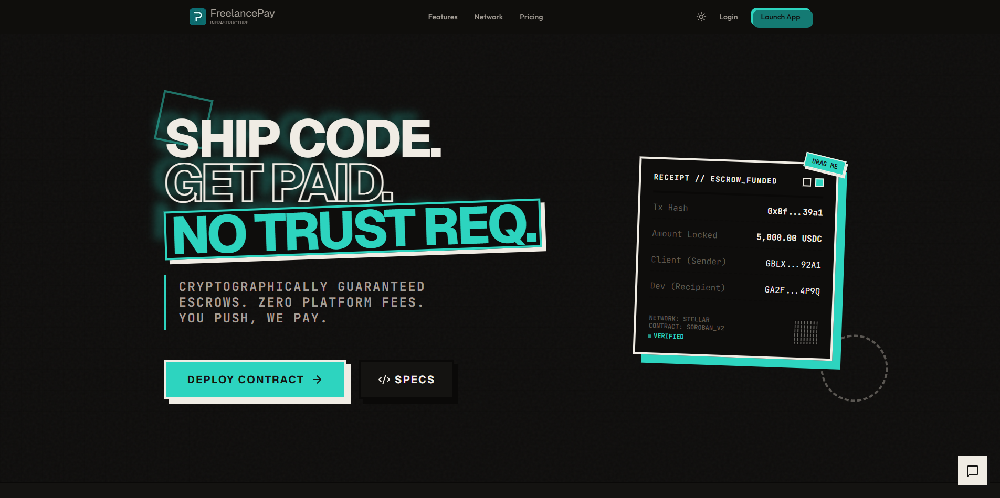
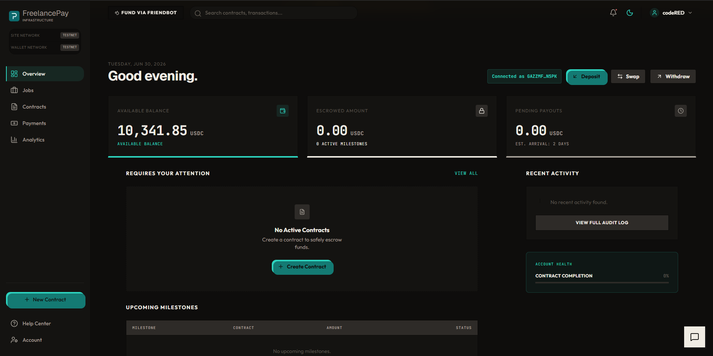
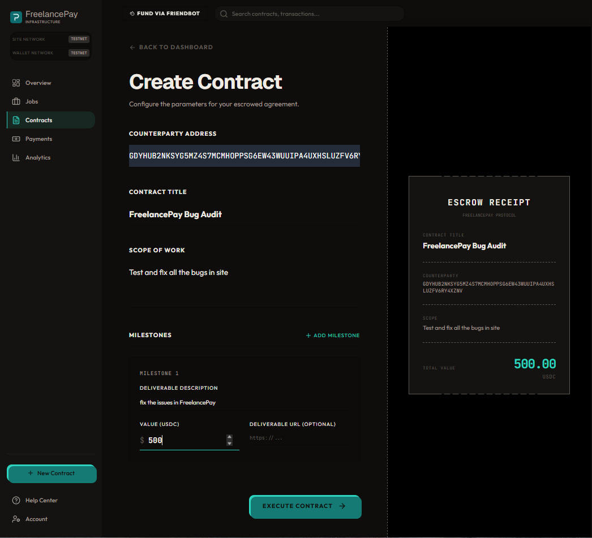
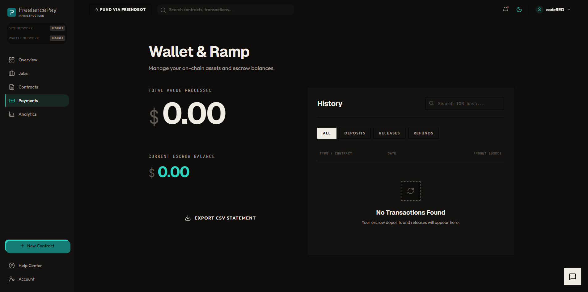
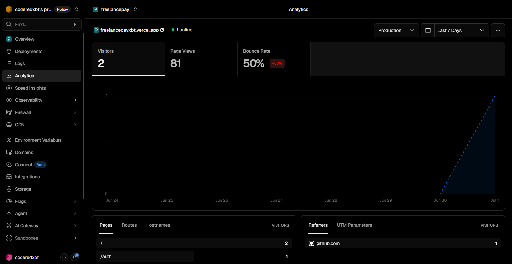
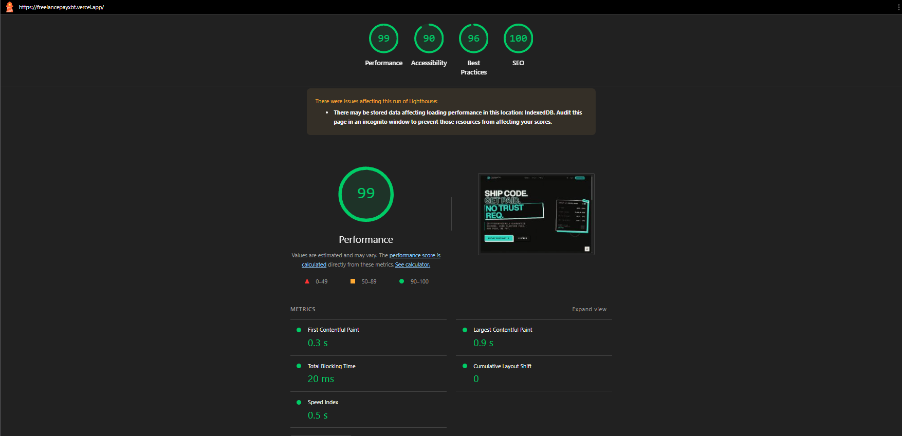

# FreelancePay

> Trustless Milestone Escrow & Cross-Border Payouts on Stellar

**Author:** codeREDxbt  
**GitHub:** [codeREDxbt](https://github.com/codeREDxbt)

## Live Demo & Links
- **Live Demo:** [freelancepayxbt.vercel.app](https://freelancepayxbt.vercel.app)
- **Demo Video Script:** [docs/demo-script.md](./docs/demo-script.md)
- **Pitch Deck Outline:** [docs/pitch-outline.md](./docs/pitch-outline.md)
- **Contract Address (Soroban Testnet):** `CAC3XR6VYSDMTUNQXIJGOVJEEOO6H5PTFCS5VHPY5X64JAXKIJNBOGLU`
- **Proof of 10+ Wallet Interactions:** [View on Stellar Expert](https://stellar.expert/explorer/testnet/contract/CAC3XR6VYSDMTUNQXIJGOVJEEOO6H5PTFCS5VHPY5X64JAXKIJNBOGLU)
- **Level 5 Plan:** [docs/level-5-plan.md](./docs/level-5-plan.md)

## About the Project

FreelancePay is a decentralized platform built to secure work and payments using programmable trust on the Stellar network. It provides milestone-based escrow tailored for the global workforce, ensuring that freelancers get paid for their completed work and clients only release funds when milestones are met.

This repository contains **over 15+ meaningful commits**, showcasing continuous development, smart contract integration, UI improvements, and core feature implementations.

## Key Highlights

- **Real-World Usefulness:** FreelancePay solves the classic "trust issue" in gig work. By utilizing programmable escrow, freelancers are guaranteed payment upon successful completion of work, while clients are protected from paying for incomplete deliverables. This bridges the gap for a global workforce relying on fast, borderless payments.
- **Technical Complexity:** The platform seamlessly integrates on-chain Stellar Soroban smart contracts with an off-chain Firebase architecture. We handle complex state synchronization between the blockchain and the frontend, managing wallet connections via Freighter, and secure transaction signing.
- **Architecture Quality:** Designed with scalability and security in mind. We use a hybrid model: sensitive financial logic and escrow locks live immutably on-chain (Soroban Rust contracts), while fast, queryable metadata (user profiles, job listings) lives off-chain in Firebase. The frontend is powered by Next.js App Router for optimal SEO and performance.
- **Product Quality:** We emphasize a premium, production-ready user experience. The UI is clean and intuitive, featuring responsive mobile-first design, comprehensive error handling (monitored via Sentry), and real-time user behavior analytics (via PostHog).

## Project Structure

```text
FreelancePay/
├── contracts/       # Stellar Soroban Rust smart contracts
├── functions/       # Firebase Cloud Functions backend
├── public/          # Static assets (images, icons, etc.)
├── scripts/         # Helper scripts (seeding, maintenance)
├── src/             # Next.js frontend source code
│   ├── app/         # App router pages and API routes
│   ├── components/  # Reusable React components
│   ├── constants/   # Configuration constants
│   ├── hooks/       # Custom React hooks
│   ├── lib/         # Utility functions and shared logic
│   └── types/       # TypeScript type definitions
├── tests/           # Integration and E2E tests
└── test/            # Unit tests
```

## Screenshots

### Product UI & Landing


### Dashboard


### Contracts & Milestones


### Stellar Smart Contract


### Payments


### Mobile Responsive Design


### Analytics & Monitoring


### Performance (Lighthouse)


*Note: The platform utilizes Vercel Analytics for traffic and performance monitoring, alongside PostHog for user behavior tracking.*

## User Feedback Summary

During the initial testing phase, we collected feedback from early users testing the platform on the Soroban Testnet:
- **Clean and Intuitive UI:** Users consistently praised the dashboard layout and the ease of navigating between contracts, milestones, and payments.
- **Trust and Security:** Freelancers loved the milestone-based escrow concept, noting that it brings peace of mind knowing funds are locked in a smart contract.
- **Wallet Integration:** The seamless integration with Freighter was highlighted as a smooth experience, though some users requested support for additional wallets in the future.
- **Mobile Experience:** The responsive design was well-received, allowing users to check their payment statuses easily on their phones.

## Analytics & Traction Proof

FreelancePay implements a robust growth infrastructure to capture user intent, track conversion funnels, and prove product-market fit:
- **PostHog Integration:** Complete event tracking across the user journey (e.g., `wallet_connected`, `contract_create_started`, `escrow_funded`, `milestone_submitted`).
- **Activity Feeds:** Real-time visibility into contract status changes, backed by on-chain proofs linking directly to Stellar Expert.
- **Conversion Tracking:** Funnels are monitored to identify drop-offs during the contract creation and invite acceptance phases.

## User Feedback & Iteration

We prioritize rapid iteration based on real user feedback. The platform features an **In-App Feedback Modal** allowing users to rate their experience and provide comments instantly after completing core actions (e.g., funding an escrow or releasing a payout).

### Iteration Summary (Level 5 Upgrade)
Based on early user testing and growth analysis, we implemented the following "Level 5" features to remove friction and accelerate the growth loop:
1. **Frictionless Feedback Loop:** An integrated global `FeedbackModal` captures 1-5 star ratings and qualitative feedback directly after core user actions (accepting contracts, funding, releasing milestones). Data is synced directly to Firestore.
2. **Guided Onboarding & Viral Invites:** A seamless "Invite Counterparty" UI on the contract dashboard allows users to easily copy `?invite=` links, enabling freelancers and clients to instantly join a specific contract context.
3. **Contract Action Clarity:** A refined contract dashboard featuring clear "Next Action" callouts and explicit role-based tags (`Freelancer Action Required`, `Client Action Required`) on milestones to prevent stalled contracts.
4. **Error Recovery & Network State:** Granular loading states (`Awaiting Wallet Signature...` and `Submitting to Stellar Network...`) for all on-chain actions to build trust, plus a Testnet troubleshooting block linked directly to the Stellar faucet.

*Note: For a detailed breakdown of the Level 5 iterations, see [docs/iteration-summary.md](./docs/iteration-summary.md).*

### Improvement Roadmap
- **Social Proof:** Implementing public profiles and successful contract histories.
- **Multi-chain / Multi-asset:** Expanding beyond USDC on Stellar to support additional assets.
- **Dispute Resolution DAOs:** Decentralizing the arbitration process for disputed contracts.

## Tech Stack
- **Frontend:** Next.js 16, React 19, TypeScript, Tailwind CSS
- **Blockchain:** Stellar Soroban (Rust smart contracts)
- **Wallet:** Freighter (Stellar Wallets Kit)
- **Database:** Firebase Firestore (with security rules)
- **Monitoring & Analytics:** Sentry, PostHog, Vercel Analytics
- **Deployment:** Vercel

## Complete Documentation & Setup

### Prerequisites
- Node.js & pnpm
- Rust toolchain (for Soroban contracts)
- Stellar CLI

### Installation
```bash
git clone https://github.com/codeREDxbt/FreelancePay
cd FreelancePay
pnpm install
cp .env.example .env.local
```

Fill in the `.env.local` values (Firebase config, Soroban RPC, PostHog keys, etc.).

### Running Locally
```bash
pnpm dev
```
Navigate to `http://localhost:3000` to view the app.

### Smart Contract Deployment
The smart contract is located in `contracts/escrow/`.

To build the contract:
```bash
cd contracts/escrow
cargo check --target wasm32-unknown-unknown
cargo test
```

To deploy the contract to Testnet:
```bash
stellar contract deploy \
  --source admin \
  --network testnet \
  --wasm target/wasm32-unknown-unknown/release/escrow.wasm
```

### Monitoring & Analytics
- **Vercel Speed Insights** are enabled for performance tracking.
- **PostHog** is set up for event tracking and user behavior analytics. (Note: Disable adblockers locally to test analytics ingestion).
- **Sentry** is configured for error tracking and performance monitoring.

---
*Built for the Stellar ecosystem.*
