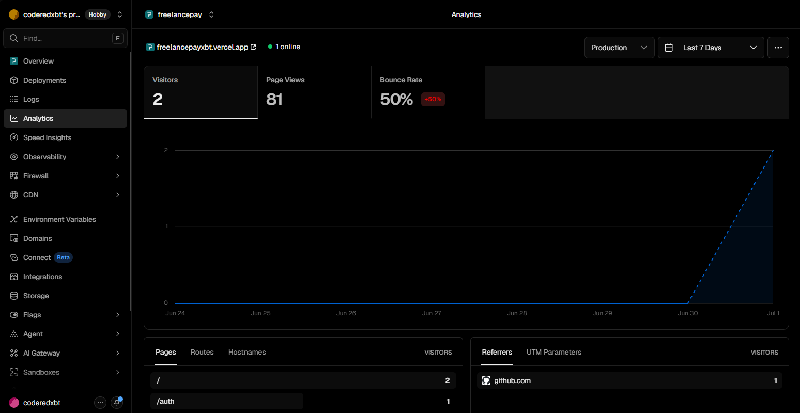
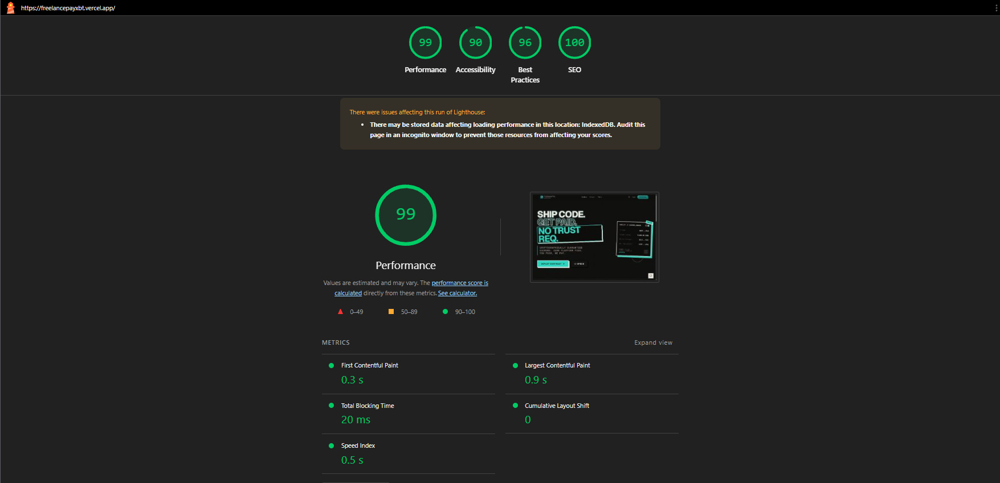

<a name="readme-top"></a>

<!-- PROJECT LOGO -->
<br />
<div align="center">
  <a href="https://github.com/codeREDxbt/FreelancePay">
    
  </a>

<h3 align="center">FreelancePay</h3>

  <p align="center">
    Trustless Milestone Escrow & Cross-Border Payouts on Stellar
    <br />
    <a href="https://github.com/codeREDxbt/FreelancePay"><strong>Explore the docs »</strong></a>
    <br />
    <br />
    <a href="https://freelancepayxbt.vercel.app">View Demo</a>
    ·
    <a href="https://github.com/codeREDxbt/FreelancePay/issues">Report Bug</a>
    ·
    <a href="https://github.com/codeREDxbt/FreelancePay/issues">Request Feature</a>
  </p>
</div>


<!-- TABLE OF CONTENTS -->
<details>
  <summary>Table of Contents</summary>
  <ol>
    <li>
      <a href="#about-the-project">About The Project</a>
      <ul>
        <li><a href="#built-with">Built With</a></li>
        <li><a href="#key-highlights">Key Highlights</a></li>
        <li><a href="#project-structure">Project Structure</a></li>
      </ul>
    </li>
    <li>
      <a href="#getting-started">Getting Started</a>
      <ul>
        <li><a href="#prerequisites">Prerequisites</a></li>
        <li><a href="#installation">Installation</a></li>
        <li><a href="#smart-contract-deployment">Smart Contract Deployment</a></li>
      </ul>
    </li>
    <li><a href="#usage">Usage</a></li>
    <li><a href="#user-feedback--traction">User Feedback & Traction</a></li>
    <li><a href="#roadmap">Roadmap</a></li>
    <li><a href="#contributing">Contributing</a></li>
    <li><a href="#license">License</a></li>
    <li><a href="#contact">Contact</a></li>
    <li><a href="#acknowledgments">Acknowledgments</a></li>
  </ol>
</details>


<!-- ABOUT THE PROJECT -->
## About The Project


FreelancePay is a decentralized platform built to secure work and payments using programmable trust on the Stellar network. It provides milestone-based escrow tailored for the global workforce, ensuring that freelancers get paid for their completed work and clients only release funds when milestones are met.

This repository contains **over 15+ meaningful commits**, showcasing continuous development, smart contract integration, UI improvements, and core feature implementations.

### Important Links
- **Contract Address (Soroban Testnet):** `CAC3XR6VYSDMTUNQXIJGOVJEEOO6H5PTFCS5VHPY5X64JAXKIJNBOGLU`
- **Proof of 10+ Wallet Interactions:** [View on Stellar Expert](https://stellar.expert/explorer/testnet/contract/CAC3XR6VYSDMTUNQXIJGOVJEEOO6H5PTFCS5VHPY5X64JAXKIJNBOGLU)
- **Demo Video Script:** [docs/demo-script.md](./docs/demo-script.md)
- **Pitch Deck Outline:** [docs/pitch-outline.md](./docs/pitch-outline.md)
- **Level 5 Plan:** [docs/level-5-plan.md](./docs/level-5-plan.md)

<!-- TODO: Add more about the project context, inspiration, or business model here -->

### Key Highlights
- **Real-World Usefulness:** FreelancePay solves the classic "trust issue" in gig work. By utilizing programmable escrow, freelancers are guaranteed payment upon successful completion of work, while clients are protected from paying for incomplete deliverables. This bridges the gap for a global workforce relying on fast, borderless payments.
- **Technical Complexity:** The platform seamlessly integrates on-chain Stellar Soroban smart contracts with an off-chain Firebase architecture. We handle complex state synchronization between the blockchain and the frontend, managing wallet connections via Freighter, and secure transaction signing.
- **Architecture Quality:** Designed with scalability and security in mind. We use a hybrid model: sensitive financial logic and escrow locks live immutably on-chain (Soroban Rust contracts), while fast, queryable metadata (user profiles, job listings) lives off-chain in Firebase. The frontend is powered by Next.js App Router for optimal SEO and performance.
- **Product Quality:** We emphasize a premium, production-ready user experience. The UI is clean and intuitive, featuring responsive mobile-first design, comprehensive error handling (monitored via Sentry), and real-time user behavior analytics (via PostHog).

### Project Structure

```text
FreelancePay/
├── contracts/       # Stellar Soroban Rust smart contracts
├── functions/       # Firebase Cloud Functions backend
├── public/          # Static assets (images, icons, etc.)
├── scripts/         # Helper scripts (seeding, maintenance)
├── src/             # Next.js frontend source code
│   ├── app/         # App router pages and API routes
│   ├── components/  # Reusable React components
│   ├── constants/   # Configuration constants
│   ├── hooks/       # Custom React hooks
│   ├── lib/         # Utility functions and shared logic
│   └── types/       # TypeScript type definitions
├── tests/           # Integration and E2E tests
└── test/            # Unit tests
```

<p align="right">(<a href="#readme-top">back to top</a>)</p>


### Built With

* [![Next][Next.js]][Next-url]
* [![React][React.js]][React-url]
* [![Tailwind CSS][Tailwind.com]][Tailwind-url]
* [![Stellar][Stellar.com]][Stellar-url]
* [![Firebase][Firebase.com]][Firebase-url]
* [![TypeScript][TypeScript.com]][TypeScript-url]
* [![Rust][Rust.com]][Rust-url]

<!-- TODO: Add more badges for other technologies used like Sentry, PostHog, Vercel, Rust etc. -->

<p align="right">(<a href="#readme-top">back to top</a>)</p>


<!-- GETTING STARTED -->
## Getting Started

To get a local copy up and running follow these simple steps.

### Prerequisites

* Node.js & pnpm
* Rust toolchain (for Soroban contracts)
* Stellar CLI

### Installation

1. Clone the repo
   ```sh
   git clone https://github.com/codeREDxbt/FreelancePay.git
   cd FreelancePay
   ```
2. Install NPM packages using pnpm
   ```sh
   pnpm install
   ```
3. Copy environment variables
   ```sh
   cp .env.example .env.local
   ```
4. Fill in the `.env.local` values (Firebase config, Soroban RPC, PostHog keys, etc.).
5. Run the local development server
   ```sh
   pnpm dev
   ```
   Navigate to `http://localhost:3000` to view the app.

### Smart Contract Deployment
The smart contract is located in `contracts/escrow/`.

To build the contract:
```bash
cd contracts/escrow
cargo check --target wasm32-unknown-unknown
cargo test
```

To deploy the contract to Testnet:
```bash
stellar contract deploy \
  --source admin \
  --network testnet \
  --wasm target/wasm32-unknown-unknown/release/escrow.wasm
```

### Monitoring & Analytics setup
- **Vercel Speed Insights** are enabled for performance tracking.
- **PostHog** is set up for event tracking and user behavior analytics. (Note: Disable adblockers locally to test analytics ingestion).
- **Sentry** is configured for error tracking and performance monitoring.

<!-- TODO: Add any additional installation or deployment steps if necessary -->

<p align="right">(<a href="#readme-top">back to top</a>)</p>


<!-- USAGE EXAMPLES -->
## Usage

Here are some screenshots demonstrating the core functionality and design of FreelancePay.

### Product UI & Views
* **Dashboard**
  
* **Contracts & Milestones**
  
* **Stellar Smart Contract**
  
* **Payments**
  
* **Mobile Responsive Design**
  
* **Analytics Dashboard**
  
* **Performance (Lighthouse)**
  

_For more examples and detailed workflows, please refer to the [Documentation](https://github.com/codeREDxbt/FreelancePay)_

<!-- TODO: Add more usage examples, code snippets, or user flows here -->

<p align="right">(<a href="#readme-top">back to top</a>)</p>


<!-- USER FEEDBACK & TRACTION -->
## User Feedback & Traction

FreelancePay implements a robust growth infrastructure to capture user intent, track conversion funnels, and prove product-market fit.

### User Feedback Summary
During the initial testing phase, we collected feedback from early users testing the platform on the Soroban Testnet:
- **Clean and Intuitive UI:** Users consistently praised the dashboard layout and the ease of navigating between contracts, milestones, and payments.
- **Trust and Security:** Freelancers loved the milestone-based escrow concept, noting that it brings peace of mind knowing funds are locked in a smart contract.
- **Wallet Integration:** The seamless integration with Freighter was highlighted as a smooth experience, though some users requested support for additional wallets in the future.
- **Mobile Experience:** The responsive design was well-received, allowing users to check their payment statuses easily on their phones.

### Analytics & Traction Proof
- **PostHog Integration:** Complete event tracking across the user journey (e.g., `wallet_connected`, `contract_create_started`, `escrow_funded`, `milestone_submitted`).
- **Activity Feeds:** Real-time visibility into contract status changes, backed by on-chain proofs linking directly to Stellar Expert.
- **Conversion Tracking:** Funnels are monitored to identify drop-offs during the contract creation and invite acceptance phases.

### Iteration Summary (Level 5 Upgrade)
Based on early user testing and growth analysis, we implemented the following "Level 5" features to remove friction and accelerate the growth loop:
1. **Frictionless Feedback Loop:** An integrated global `FeedbackModal` captures 1-5 star ratings and qualitative feedback directly after core user actions (accepting contracts, funding, releasing milestones). Data is synced directly to Firestore.
2. **Guided Onboarding & Viral Invites:** A seamless "Invite Counterparty" UI on the contract dashboard allows users to easily copy `?invite=` links, enabling freelancers and clients to instantly join a specific contract context.
3. **Contract Action Clarity:** A refined contract dashboard featuring clear "Next Action" callouts and explicit role-based tags (`Freelancer Action Required`, `Client Action Required`) on milestones to prevent stalled contracts.
4. **Error Recovery & Network State:** Granular loading states (`Awaiting Wallet Signature...` and `Submitting to Stellar Network...`) for all on-chain actions to build trust, plus a Testnet troubleshooting block linked directly to the Stellar faucet.

*Note: For a detailed breakdown of the Level 5 iterations, see [docs/iteration-summary.md](./docs/iteration-summary.md).*

<!-- TODO: Insert any additional metrics, charts, or growth stats here -->

<p align="right">(<a href="#readme-top">back to top</a>)</p>


<!-- ROADMAP -->
## Roadmap

- [x] Initial release on Soroban Testnet
- [x] Level 5 Features (Feedback loop, Viral Invites, Error Recovery)
- [ ] **Social Proof:** Implementing public profiles and successful contract histories.
- [ ] **Multi-chain / Multi-asset:** Expanding beyond USDC on Stellar to support additional assets.
- [ ] **Dispute Resolution DAOs:** Decentralizing the arbitration process for disputed contracts.

See the [open issues](https://github.com/codeREDxbt/FreelancePay/issues) for a full list of proposed features (and known issues).

<!-- TODO: Update roadmap with specific timelines or milestones -->

<p align="right">(<a href="#readme-top">back to top</a>)</p>


<!-- CONTRIBUTING -->
## Contributing

Contributions are what make the open source community such an amazing place to learn, inspire, and create. Any contributions you make are **greatly appreciated**.

If you have a suggestion that would make this better, please fork the repo and create a pull request. You can also simply open an issue with the tag "enhancement".
Don't forget to give the project a star! Thanks again!

1. Fork the Project
2. Create your Feature Branch (`git checkout -b feature/AmazingFeature`)
3. Commit your Changes (`git commit -m 'Add some AmazingFeature'`)
4. Push to the Branch (`git push origin feature/AmazingFeature`)
5. Open a Pull Request

<!-- TODO: Add any specific contribution guidelines for this project -->

<p align="right">(<a href="#readme-top">back to top</a>)</p>


<!-- LICENSE -->
## License

Distributed under the MIT License. See `LICENSE` for more information.

<!-- TODO: Ensure a LICENSE file exists in the repository -->

<p align="right">(<a href="#readme-top">back to top</a>)</p>


<!-- CONTACT -->
## Contact

codeREDxbt - [@codeREDxbt](https://twitter.com/codeREDxbt) - email@example.com

Project Link: [https://github.com/codeREDxbt/FreelancePay](https://github.com/codeREDxbt/FreelancePay)

<!-- TODO: Update with actual email and Twitter handler -->

<p align="right">(<a href="#readme-top">back to top</a>)</p>


<!-- ACKNOWLEDGMENTS -->
## Acknowledgments

* [Stellar Network](https://stellar.org/)
* [Soroban](https://soroban.stellar.org/)
* [Freighter Wallet](https://www.freighter.app/)
* [Next.js](https://nextjs.org/)
* [Firebase](https://firebase.google.com/)

<!-- TODO: Add any other resources, tools, or individuals you'd like to acknowledge -->

<p align="right">(<a href="#readme-top">back to top</a>)</p>


<!-- MARKDOWN LINKS & IMAGES -->
<!-- https://www.markdownguide.org/basic-syntax/#reference-style-links -->
[Next.js]: https://img.shields.io/badge/next.js-000000?style=for-the-badge&logo=nextdotjs&logoColor=white
[Next-url]: https://nextjs.org/
[React.js]: https://img.shields.io/badge/React-20232A?style=for-the-badge&logo=react&logoColor=61DAFB
[React-url]: https://reactjs.org/
[Tailwind.com]: https://img.shields.io/badge/Tailwind_CSS-38B2AC?style=for-the-badge&logo=tailwind-css&logoColor=white
[Tailwind-url]: https://tailwindcss.com
[Stellar.com]: https://img.shields.io/badge/Stellar-000000?style=for-the-badge&logo=stellar&logoColor=white
[Stellar-url]: https://stellar.org/
[Firebase.com]: https://img.shields.io/badge/Firebase-FFCA28?style=for-the-badge&logo=firebase&logoColor=white
[Firebase-url]: https://firebase.google.com/
[TypeScript.com]: https://img.shields.io/badge/TypeScript-007ACC?style=for-the-badge&logo=typescript&logoColor=white
[TypeScript-url]: https://www.typescriptlang.org/
[Rust.com]: https://img.shields.io/badge/Rust-000000?style=for-the-badge&logo=rust&logoColor=white
[Rust-url]: https://www.rust-lang.org/
