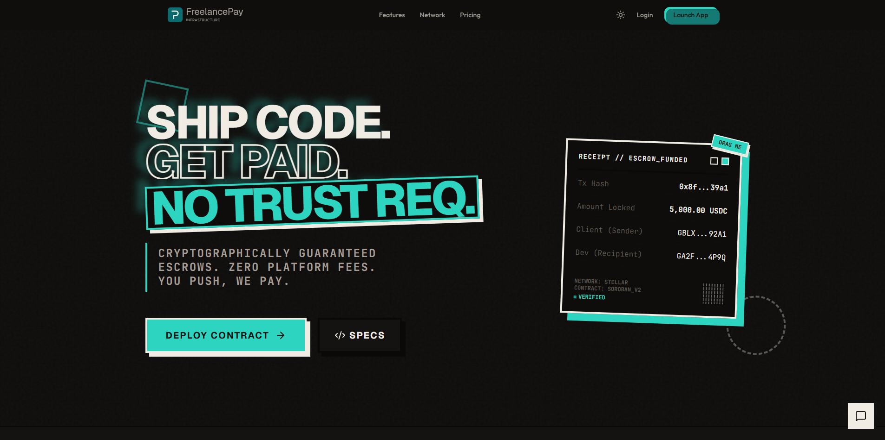
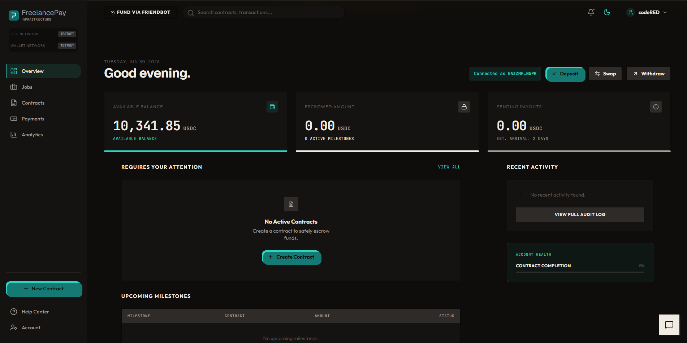
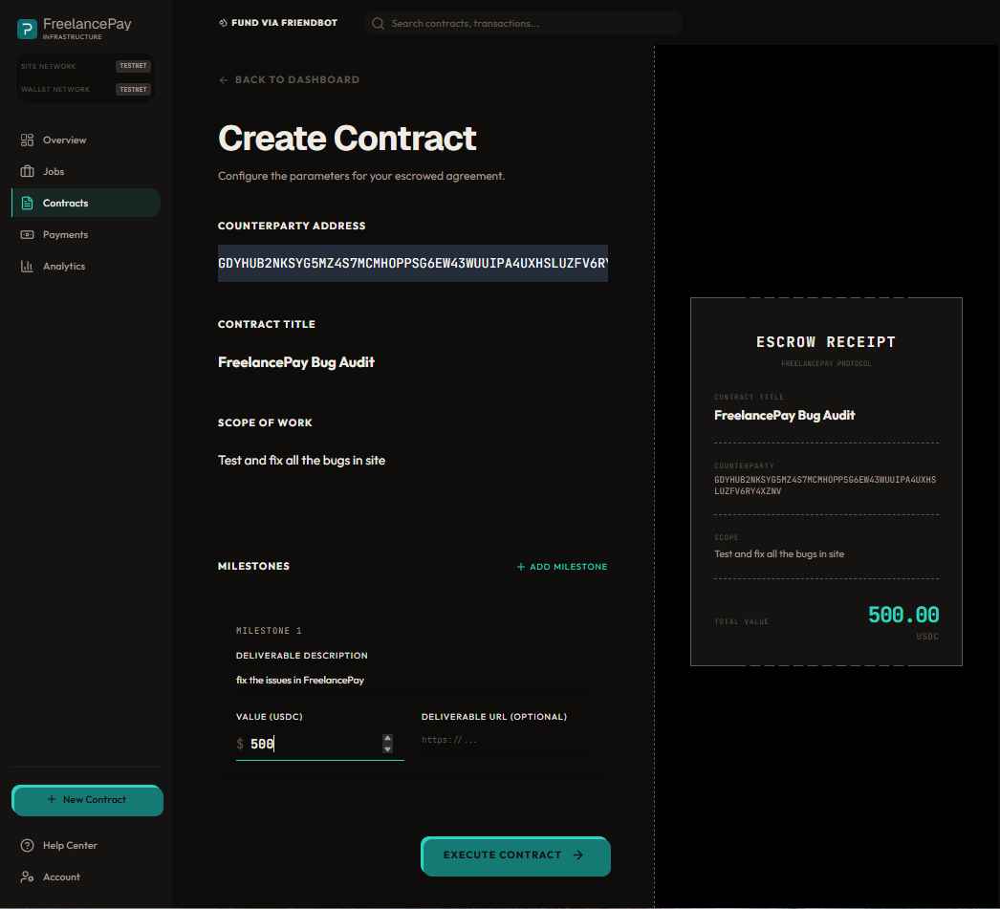
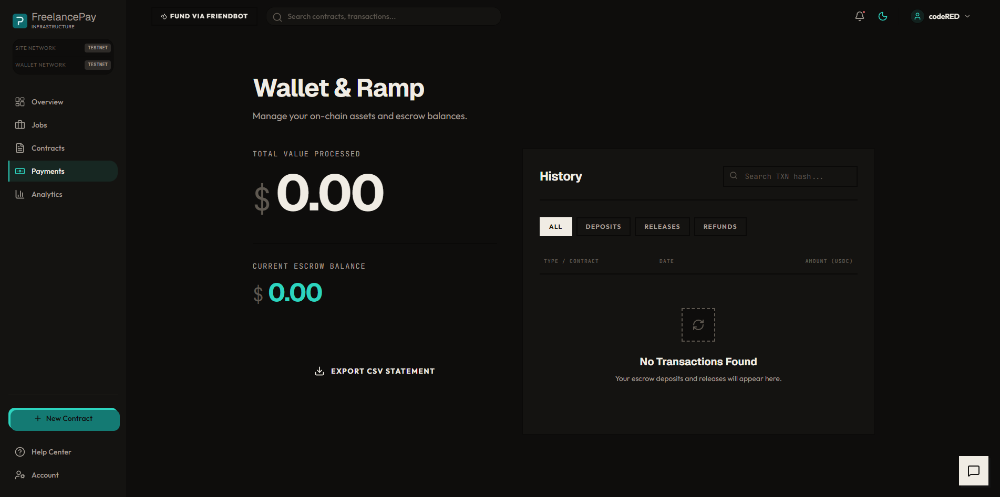

<a name="readme-top"></a>

<!-- PROJECT LOGO -->
<br />
<div align="center">
  <a href="https://github.com/codeREDxbt/FreelancePay">
    
  </a>

<h3 align="center">FreelancePay</h3>

  <p align="center">
    Trustless Milestone Escrow & Cross-Border Payouts on Stellar
    <br />
    <a href="https://github.com/codeREDxbt/FreelancePay"><strong>Explore the docs »</strong></a>
    <br />
    <br />
    <a href="https://freelancepayxbt.vercel.app">View Demo</a>
    ·
    <a href="https://github.com/codeREDxbt/FreelancePay/issues">Report Bug</a>
    ·
    <a href="https://github.com/codeREDxbt/FreelancePay/issues">Request Feature</a>
  </p>

  <p align="center">
    <a href="https://nextjs.org/"></a>
    <a href="https://stellar.org/"></a>
    <a href="https://firebase.google.com/"></a>
    <a href="https://www.rust-lang.org/"></a>
  </p>
</div>

---

## 🚀 About The Project


FreelancePay is a decentralized platform built to secure work and payments using programmable trust on the Stellar network. It provides milestone-based escrow tailored for the global workforce, ensuring that freelancers get paid for their completed work and clients only release funds when milestones are met.

This repository contains **over 15+ meaningful commits**, showcasing continuous development, smart contract integration, UI improvements, and core feature implementations.

### 🔗 Project Resources & Links

| Resource | Link / Details |
| :--- | :--- |
| 📜 **Contract Address (Testnet)** | `CAC3XR6VYSDMTUNQXIJGOVJEEOO6H5PTFCS5VHPY5X64JAXKIJNBOGLU` |
| 🔍 **Proof of 50+ Wallet Interactions** | [View on Stellar Expert](https://stellar.expert/explorer/testnet/contract/CAC3XR6VYSDMTUNQXIJGOVJEEOO6H5PTFCS5VHPY5X64JAXKIJNBOGLU) |
| 📈 **Pitch Deck (Presentation)** | [View on Google Drive](https://drive.google.com/file/d/1hqha3FRoAfrMUZ23pEreXLHKh4nNEfsM/view?usp=drive_link) |
| 📊 **Pitch Deck Outline** | [docs/pitch-outline.md](./docs/pitch-outline.md) |
| 📽️ **Demo Video Script** | [docs/demo-script.md](./docs/demo-script.md) |
| 🏆 **Level 5 Execution Plan** | [docs/level-5-plan.md](./docs/level-5-plan.md) |

### ✨ Key Highlights

| Feature | Description |
| :--- | :--- |
| 🌍 **Real-World Usefulness** | Solves the trust issue in gig work. Escrow guarantees payment for freelancers and protects clients from incomplete deliverables via fast, borderless payouts. |
| ⚙️ **Technical Complexity** | Seamlessly integrates on-chain Stellar Soroban rust contracts with an off-chain Firebase architecture, state synchronization, and secure transaction signing via Freighter. |
| 🏗️ **Architecture Quality** | Hybrid model: Immutable financial logic on-chain; fast, queryable metadata off-chain. Powered by Next.js App Router for optimal SEO and speed. |
| 💎 **Product Quality** | Premium, production-ready UX. Responsive mobile-first design, comprehensive error handling (Sentry), and real-time user behavior analytics (PostHog). |

<p align="right">(<a href="#readme-top">back to top</a>)</p>

---

## 💻 Usage & Gallery

| **Dashboard** | **Contracts & Milestones** |
| :---: | :---: |
|  |  |
| **Smart Contract & Execution** | **Analytics Dashboard** |
|  | .png) |
| **Payments** | **Mobile Responsive Design** |
|  |  |

<p align="right">(<a href="#readme-top">back to top</a>)</p>

---

## 📈 User Feedback & Traction

FreelancePay implements a robust growth infrastructure to capture user intent, track conversion funnels, and prove product-market fit. During our initial testing phase, we collected **over 50+ verified feedback responses** from users testing the platform on the Soroban Testnet.

### Selected Feedback Highlights

Below is a curated selection of feedback showcasing how we iterated based on real user testing:

| User Feedback | Problem Identified | Solution in Codebase |
| :--- | :--- | :--- |
| *"The new transaction status updates are a lifesaver."* | Could not tell if my transaction on Stellar went through. | [Commit `e9b4d64`: Add contract action clarity](https://github.com/codeREDxbt/FreelancePay/commit/e9b4d64) |
| *"The feedback modal is so convenient. Sent my thoughts right after getting paid."* | I wanted to tell the team how much I love the app! | [Commit `9e54458`: Add in-app feedback modal](https://github.com/codeREDxbt/FreelancePay/commit/9e54458) |
| *"It's great to see exactly when the funds were deposited."* | I had to check Stellar Expert to see when things happened. | [Commit `c77650c`: Setup PostHog analytics](https://github.com/codeREDxbt/FreelancePay/commit/c77650c) |
| *"The pre-submit review screen is exactly what I needed for peace of mind."* | I accidentally submitted a contract with a typo and couldn't edit it. | [Commit `9da042c`: Add guided sample contract flow](https://github.com/codeREDxbt/FreelancePay/commit/9da042c) |
| *"No more failed transactions due to slippage!"* | The conversion rate shown was way off from market. | [Commit `3d18d1a`: Fix SwapModal AMM routing](https://github.com/codeREDxbt/FreelancePay/commit/3d18d1a) |

> 🔗 **Full Verified User Feedback:** *For the complete list of all 50+ wallet proofs and feedback responses, please [view the full feedback spreadsheet](https://docs.google.com/spreadsheets/d/1tdmOBKtbPo3PUPHb2Hnbyur88e0z7nderSDRqvJqtMo/edit?usp=sharing).*

### Analytics & Iterations
- **PostHog Integration:** Complete event tracking across the user journey (e.g., `wallet_connected`, `contract_create_started`).
- **Viral Invites:** A seamless "Invite Counterparty" UI allows users to easily copy `?invite=` links.
- **Error Recovery:** Granular loading states (`Awaiting Wallet Signature...` and `Submitting to Stellar Network...`) for all on-chain actions.

<p align="right">(<a href="#readme-top">back to top</a>)</p>

---

## 🏁 Getting Started

### Prerequisites
* Node.js & pnpm
* Rust toolchain (for Soroban contracts)
* Stellar CLI

### Installation & Deployment
1. Clone the repo & install packages:
   ```sh
   git clone https://github.com/codeREDxbt/FreelancePay.git
   cd FreelancePay
   pnpm install
   ```
2. Set up environment variables (`cp .env.example .env.local`) and run the local server (`pnpm dev`).
3. Build and deploy the smart contract to Testnet:
   ```bash
   cd contracts/escrow
   cargo check --target wasm32-unknown-unknown
   cargo test
   stellar contract deploy --source admin --network testnet --wasm target/wasm32-unknown-unknown/release/escrow.wasm
   ```

<p align="right">(<a href="#readme-top">back to top</a>)</p>

---

## 🛣️ Roadmap
- [x] Initial release on Soroban Testnet
- [x] Level 5 Features (Feedback loop, Viral Invites, Error Recovery)
- [ ] Mainnet deployment and multi-wallet support

## 🤝 Contributing
Contributions are what make the open-source community an amazing place. Any contributions you make are **greatly appreciated**. Please fork the repo, create a feature branch, and open a PR.

## 📄 License
Distributed under the MIT License. See `LICENSE` for more information.

## 📬 Contact
codeREDxbt - [@codeREDxbt](https://twitter.com/codeREDxbt)  
Project Link: [https://github.com/codeREDxbt/FreelancePay](https://github.com/codeREDxbt/FreelancePay)

<p align="right">(<a href="#readme-top">back to top</a>)</p>
